# What's That Smell?

**A data-driven investigation into recurring chemical odors noticed by neighbors in Hyde Park, Chicago**

*Ward 5 Smell Log — October–November 2025*

---

Hyde Park and surrounding neighborhoods share an active community email list called Good Neighbors. Several times over the years, neighbors have exchanged information about strong smells noticed by multiple people simultaneously. Between October 7 and November 3, 2025, neighbors fielded an informal community survey, gathering 39 reports. Most described a **burning plastic or chemical smell**. This analysis correlates those reports with hourly weather data, PM2.5 air quality measurements from a network of sensors, and quarterly compliance reports that nearby industrial facilities filed with state regulators, to identify likely causes.

This is an ongoing, open-source investigation. The data, code, and methodology are available in this repository for review and replication. If you have questions, corrections, or additional data, please open an issue.

## Key Findings

**1. The smell comes from the southeast.** 62% of real-time reports occurred during southeast or east winds, compared to only 31% of all hours in the same period. The smell is 2.0× more likely when wind blows from the SE — a result that is statistically significant by a one-sided binomial test (p = 0.0015).[^enrichment] A more conservative episode-level circular-shift permutation test, which accounts for temporal clustering of reports and autocorrelation in wind direction, yields p ≈ 0.06–0.13 depending on the gap threshold used to define episodes — suggestive but not conventionally significant.[^permutation] When wind comes from the north or west, reports drop off sharply. On balance, the author judges that the combined evidence makes the source inferences in this report reasonable, though likely incomplete.

**2. The source area is the Calumet industrial corridor and northwest Indiana**, 10–18 miles southeast of Hyde Park. A cluster of heavy industrial facilities sits at bearings 133°–176° from Hyde Park, directly aligned with the wind during smell episodes. The top candidates by wind-bearing match are:

- **Indiana Harbor Coke Company** (East Chicago, IN) — 13 mi, bearing 146°. Operated by Cleveland-Cliffs.[^ihcc-name] Coke oven emissions produce complex mixtures of polycyclic aromatic hydrocarbons (PAHs), benzene, and coal tar volatiles — compounds with an acrid, synthetic character that closely matches the "burning plastic" description reported by neighbors.[^coke-odor]
- **BP Whiting Refinery** — 11 mi, bearing 154°. The sixth-largest refinery in the United States by capacity.[^bp-capacity] Known for hydrogen sulfide (H₂S), volatile organic compound (VOC), and flaring emissions, with an extensive enforcement history including a $40 million Clean Air Act penalty in 2023.[^bp-penalty]
- **US Steel Gary Works** — 18 mi, bearing 133°. Integrated steel mill with coke ovens.
- The **Calumet corridor** facilities (American Zinc Recycling, S.H. Bell,[^shbell] RMG, and others) at bearings 163°–176°, all approximately 10 miles away.

**3. PM2.5 (fine airborne particle) sensor data confirms plume transport from the industrial corridor to Hyde Park.** On October 12 — the largest smell episode — PM2.5 peaked at sensors near the industrial source area 4 hours before reaching Hyde Park, matching the expected travel time at the observed wind speed of ~3.5 mph. During the sustained October 25–26 episode, PM2.5 was approximately 2× higher near the source than at Hyde Park. No such pattern appeared during the October 31 westerly-wind episode, confirming the directional signal. (See [PM2.5 Plume Analysis](#pm25-plume-analysis) below.)

**4. Industrial compliance records document active violations during the study period.** Both IHCC and BP Whiting filed quarterly deviation reports with IDEM covering October–December 2025. IHCC reported visible emissions violations, backpressure events in the coke oven exhaust tunnel that can push gases outward rather than drawing them into the collection system, and failures in industrial particle filters (baghouses). BP Whiting reported a 105-hour continuous H₂S release from a weld rupture that overlapped with the entire second half of the study period, multiple unmonitored catalyst releases, and chronic equipment leaks dating back months. (See [Compliance Cross-Reference](#compliance-cross-reference) below.)

**5. Episodes cluster during stable atmospheric conditions** — light winds (mean 5.0 mph vs. 6.8 mph baseline) and elevated barometric pressure (999.9 vs. 997.1 hPa), consistent with conditions that trap and concentrate pollutants near ground level.[^stable-atm]

**6. Two independent sensor networks confirm the findings with additional pollutants.** The City of Chicago's Open Air network (Clarity Node-S sensors) measures both PM2.5 and NO₂. NO₂ — a combustion byproduct — shows the same SE-wind enrichment pattern seen in PM2.5 and smell reports. PM2.5 readings from the two independent sensor networks (PurpleAir and Chicago Open Air) correlate well in matched distance bands, ruling out sensor-specific artifacts. (See [Chicago Open Air Network](#chicago-open-air-network) below.)

**7. EPA regulatory monitors detect elevated SO₂ and benzene on the SE corridor during smell episodes.** Hourly readings from EPA-certified instruments at three Calumet corridor sites (Gary-IITRI, Hammond CAAP, East Chicago-Marina) show SO₂ spikes coinciding with SE winds and smell reports — particularly during the October 25–27 episode. Hourly benzene at East Chicago-Marina tracks smell episodes across the full study period. These are federal-reference-method instruments measuring pollutants specific to coking and refinery operations, providing the strongest source-specific corroboration in the dataset.[^so2-source] (See [EPA Regulatory Monitors](#epa-regulatory-monitors) below.)

**8. Two reports during westerly wind** (October 31 and November 3) appear to be a separate phenomenon, possibly from the Clearing industrial district or other sources to the west.

**9. One respondent reports 8–10 years of the same recurring smell**, suggesting this is a chronic, long-standing exposure — not a one-time event.

---

## How We Did the Analysis

### Data sources

| Source | What it provides | Access |
|--------|-----------------|--------|
| Ward 5 smell survey | 39 neighbor reports with timestamps, locations, descriptions, intensity (1–5) | `data/hyde_park_smell_reports_cleaned.csv` |
| Open-Meteo API | Hourly wind direction, wind speed, barometric pressure, temperature for Hyde Park | `data/open_meteo_hyde_park.json` |
| PurpleAir API | Hourly PM2.5 from 13 sensors along the SE plume corridor | `data/purpleair_plume_history_all.csv` |
| Chicago Open Air network | Hourly PM2.5 and NO₂ from ~53 Clarity Node-S sensors in the SE arc | `data/chicago_openair_history.csv` |
| EPA Air Quality System (AQS) | Hourly SO₂ and benzene from EPA-certified monitors in the Calumet corridor | `data/epa_aqs_samples.csv` |
| IDEM Virtual File Cabinet | Quarterly deviation reports from IHCC and BP Whiting | Referenced by permit number below |
| EPA ECHO | Enforcement and compliance history | [echo.epa.gov](https://echo.epa.gov) |

### Methodology overview

The analysis proceeds in six steps, each building on the last:

1. **Wind correlation.** We matched each real-time smell report to the hourly wind observation and asked: does the wind come from a consistent direction during smell episodes? It does — overwhelmingly from the SE. We tested significance with both a binomial test (treating reports as independent) and an episode-level circular-shift permutation test (accounting for temporal clustering and wind autocorrelation).

2. **Source matching.** We computed the bearing from Hyde Park to every major industrial facility in the Calumet corridor and NW Indiana, then checked how closely the wind during each episode aligned with each facility's bearing.

3. **PM2.5 plume tracking.** We pulled hourly PM2.5 data from PurpleAir sensors distributed along the hypothesized plume path (13 sensors from 0.1 to 19 miles from Hyde Park) and looked for time-lagged propagation patterns during the major smell episodes.

4. **Compliance cross-reference.** We reviewed IDEM quarterly deviation reports for the candidate facilities to check whether documented violations coincided with the smell episodes.

5. **Multi-pollutant corroboration.** We cross-validated the PurpleAir PM2.5 findings using the City of Chicago's Open Air sensor network, which independently measures both PM2.5 and NO₂ (a combustion tracer). This step tests whether the SE-wind plume signal holds for a different pollutant on different hardware.

6. **Regulatory monitor corroboration.** We checked the findings against EPA-certified regulatory monitors (Air Quality System) at three Calumet corridor sites, which measure hourly SO₂ and benzene — pollutants specific to coking and refinery operations. This step tests whether the pattern holds on federal-reference-method instruments with source-specific pollutants.

The full step-by-step analysis is in `code/hyde_park_smell_analysis.ipynb`. All data files needed to reproduce it are in `data/` (survey data not included; available upon request due to plausible PII), and the PurpleAir data retrieval scripts are in `code/`.

---

## Wind Direction Analysis

### The central result

Of the 39 total reports, 27 were real-time ("Just Now" or submitted before the timing field was added to the form). After matching to hourly weather data, 26 reports had valid wind observations. Of those:

- **16 of 26 (62%)** occurred during SE wind (67.5°–180°)
- **SE wind occurs only 31% of the time** during the study period overall
- **Enrichment ratio: 2.0×** — you are twice as likely to smell the odor when the wind blows from the SE[^enrichment]
- **One-sided binomial test: p = 0.0015** — the probability of seeing 16 or more SE-wind reports out of 26 by chance (given a 31% baseline) is less than 1 in 600
- **Episode-level permutation test: p ≈ 0.06–0.13** — when reports are collapsed into distinct smell episodes and tested against circularly-shifted wind data (preserving autocorrelation), the result remains directionally strong but is no longer significant at the conventional α = 0.05 threshold[^permutation]

### Episode timeline

The major smell episodes were:

| Dates | Reports | Wind | Best-match sources |
|-------|---------|------|--------------------|
| Oct 9–10 | 3 | SSW ~195° | Calumet corridor (American Zinc, S.H. Bell) |
| **Oct 12** | **6** | **SE 118°–137°** | **IHCC, US Steel Gary Works, BP Whiting** |
| Oct 16–17 | 4 | SE/SSW 113°–183° | IHCC, US Steel Gary Works, Calumet WRP |
| **Oct 25–26** | **4** | **SE 96°–118°** | **US Steel Gary Works, IHCC, BP Whiting** |
| Oct 31 | 1 | W 272° | Stickney WRP (different source) |
| Nov 3 | 1 | W 267° | Clearing Industrial District (different source) |

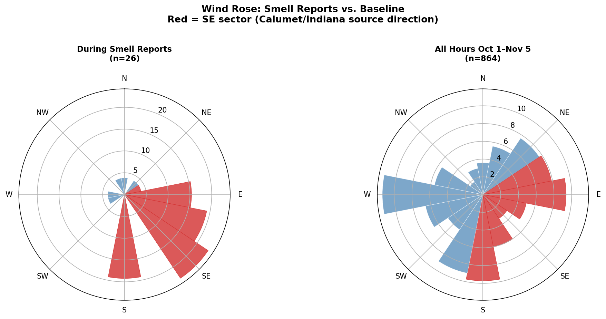

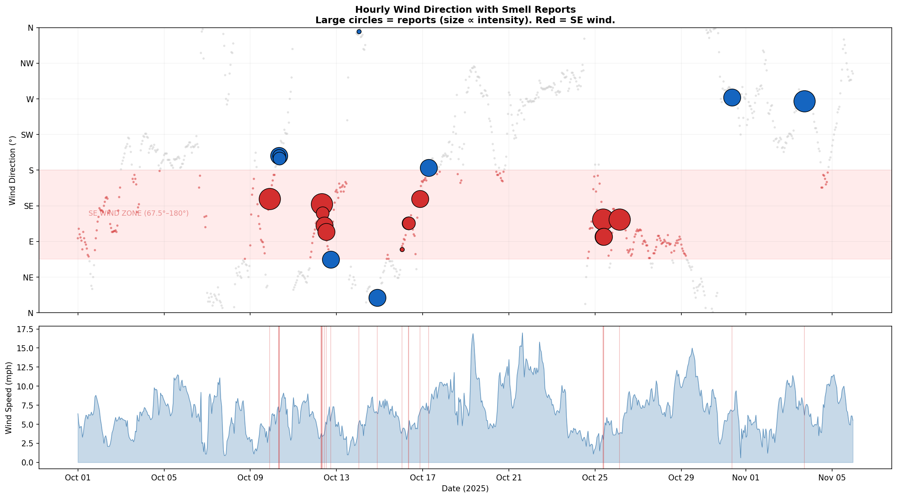

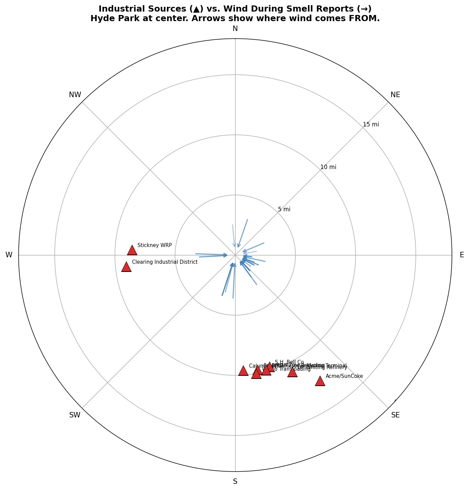

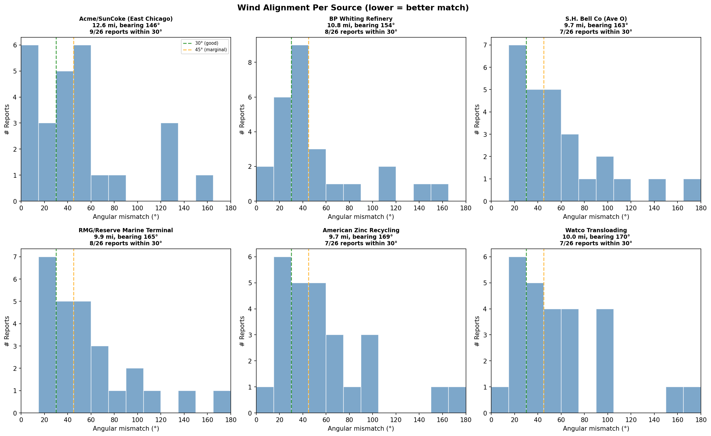

### Accounting for temporal clustering: permutation test

The binomial test above treats each of the 26 reports as an independent trial. In reality, reports cluster during the same multi-hour wind episodes — for example, 6 of the 26 reports came on October 12 alone, all during the same SE wind event. This clustering inflates the effective sample size and overstates the binomial p-value's confidence.

To address this, we group reports into distinct **smell episodes** (consecutive reports within 6 hours count as one event), then apply a **circular time-shift permutation test**: we slide all episode timestamps by the same random offset around the study calendar and check the wind at the shifted times. The question is: if the smell episodes had landed on random dates instead, how often would the wind have been just as strongly from the SE? Over 10,000 random shifts, only about 6–13% produce SE enrichment as large as observed, depending on the gap threshold used to define episodes (3 to 24 hours).[^permutation]

In other words, the SE–smell connection is stronger than roughly 90–94% of chance arrangements — but the effective sample of independent episodes is small enough that the conventional significance threshold (p < 0.05) is not met. The physical evidence from PM2.5 plume tracking and compliance records provides corroboration that the wind-based statistical tests alone cannot.

### Why we probably can't pin it to one facility

At 10–15 miles, atmospheric turbulence disperses a plume across a broad arc.[^plume-spread] The Calumet corridor sources sit in a 15° band (154°–176°) and the coke/steel plants in Indiana cover another 15° (133°–146°). When wind comes from this broad SE quadrant, emissions from multiple sources mix before reaching Hyde Park. Different episodes likely emphasize different sources depending on the exact wind bearing and atmospheric conditions.

---

## PM2.5 Plume Analysis

### Sensor network

We queried the PurpleAir API for outdoor sensors along the SE corridor from Hyde Park to Gary, IN. Of 73 outdoor sensors in the SE arc, we selected 21 on bearings 135°–165° — aligned with BP Whiting (154°), IHCC (146°), and the Calumet facilities. Thirteen returned data for October 2025. The retrieval script is at `code/purpleair_history_pull.py`.

Five sensors at well-spaced distances serve as the primary reference set:

| Sensor | Distance | Role |
|--------|----------|------|
| Canalport (NLCEP) | 12.4 mi | Near source (Whiting/East Chicago area) |
| Oliver (NLCEP) | 9.2 mi | Mid-corridor |
| Bug | 6.9 mi | SE Chicago |
| Rooster | 5.4 mi | Mid-path |
| Purple-HP-1 | 0.1 mi | Hyde Park (observation point) |

### October 12: Plume propagation

October 12 was the largest smell episode — 6 reports between 6:53 AM and 5:25 PM CT, all during SE wind at 3.4–5.3 mph.

The PM2.5 peak moved progressively from the source area to Hyde Park:

| Sensor | Distance | Peak hour (UTC) | Peak PM2.5 | Lag |
|--------|----------|-----------------|------------|-----|
| Canalport | 12.4 mi | 07:00 | 12.7 µg/m³ | 0h |
| Oliver | 9.2 mi | 08:00 | 15.4 µg/m³ | 1h |
| Bug | 6.9 mi | 08:00 | 13.3 µg/m³ | 1h |
| Rooster | 5.4 mi | 09:00 | 11.7 µg/m³ | 2h |
| Purple-HP-1 | 0.1 mi | 11:00 | 11.4 µg/m³ | 4h |

The 4-hour lag from Canalport to Hyde Park matches the expected travel time: 12 miles at ~3.5 mph = 3.4 hours.[^transport-approx] This is direct physical evidence of airborne transport from the industrial corridor to Hyde Park.

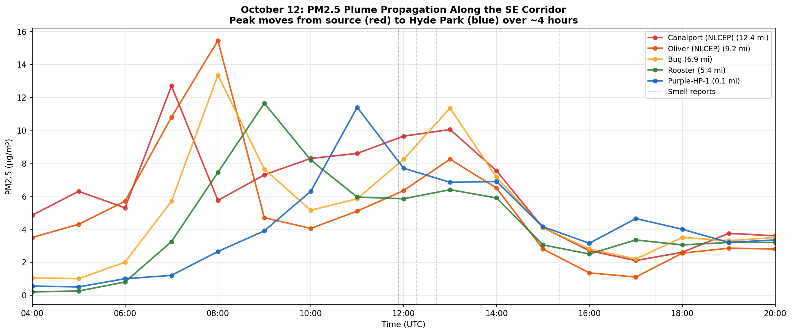

### October 25–26: Distance gradient

During this sustained SE-wind episode, PM2.5 was consistently higher near the source than at Hyde Park. During the peak window (October 26, 05:00–09:00 UTC), the near-source sensor averaged approximately 2× the Hyde Park reading — the expected signature of a dispersing point-source plume.

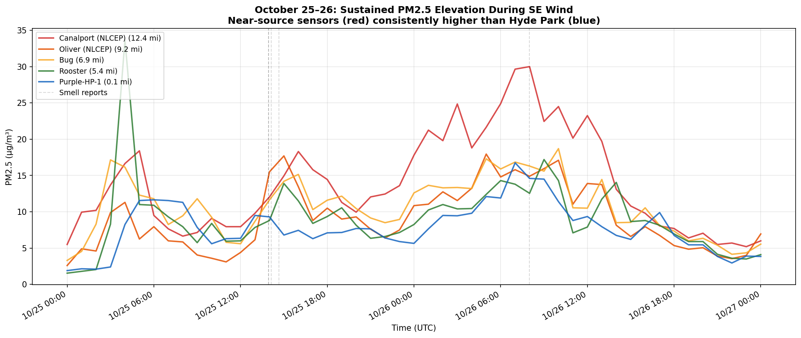

### October 31: Negative control

During the westerly-wind episode, all sensors spiked simultaneously with no distance-dependent lag and no systematic gradient. This is what we'd expect when the source is *not* in the SE corridor, and it confirms that the October 12 and October 25–26 patterns are not artifacts of regional weather or the sensor network itself.

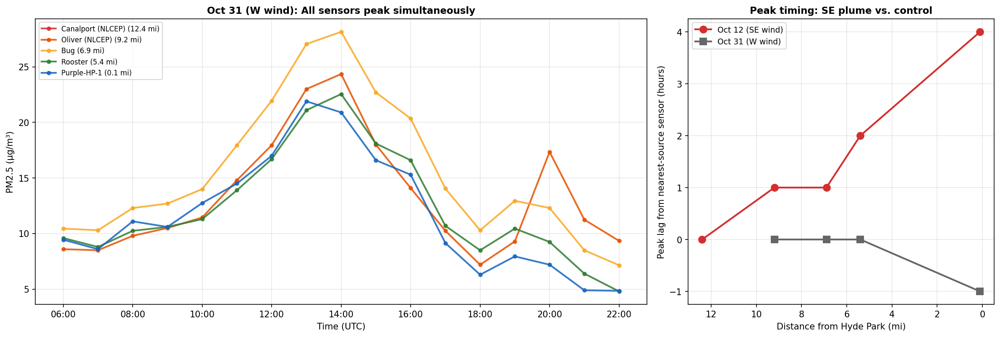

### Limitations of PM2.5 as a plume tracer

PM2.5 is a general indicator, not specific to any source or pollutant.[^pm25-general] PurpleAir sensors are low-cost instruments with known humidity sensitivity;[^purpleair-humidity] we mitigate this by analyzing relative patterns (timing and gradients) rather than absolute concentrations, and by using multiple sensors at similar distances for cross-validation. There is a coverage gap between 0 and 5 miles from Hyde Park.

---

## Independent Corroboration

The PM2.5 plume analysis above uses a single pollutant from a single sensor network. To rule out sensor-specific artifacts and to narrow the source type, we cross-checked the findings against two additional, independent monitoring systems — each measuring different pollutants on different hardware.

### Chicago Open Air Network

#### A second sensor network with a second pollutant

The City of Chicago launched its **Open Air** monitoring network in summer 2025 — roughly 277 Clarity Node-S sensors distributed across all 77 community areas, reporting hourly PM2.5 and NO₂ through the [Chicago Open Data Portal](https://data.cityofchicago.org/). After filtering to the SE arc between Hyde Park and the Calumet corridor, approximately 53 sensors fall in our study area (bearings 144°–198°, distances 0.7–10.3 miles). The data retrieval script is at `code/chicago_openair_pull.py`.

This network adds value in three ways:

1. **NO₂ as an independent combustion tracer.** PM2.5 has many sources — cooking, traffic, wood burning, dust. NO₂ is produced primarily by combustion (industrial stacks and vehicle engines). An SE-wind enrichment in NO₂ would independently corroborate the industrial-source hypothesis. (NO₂ also has vehicle-traffic sources, but the directional enrichment pattern separates fixed industrial sources from diffuse local traffic.)

2. **Denser spatial coverage.** The 53 SE-arc sensors fill the 0–5 mile gap between Hyde Park and the mid-corridor zone that PurpleAir leaves unsampled.

3. **Cross-validation.** Comparing PM2.5 from two independent sensor networks (PurpleAir PA-II vs. Clarity Node-S) tests whether the plume signal is real or a sensor-specific artifact.

**Note:** Clarity sensors are research-grade instruments, not EPA-certified regulatory monitors (FEM/FRM). Their readings are valid for the spatial and temporal trend analysis performed here, but cannot be used for regulatory compliance determinations.

#### NO₂ SE-wind enrichment

We computed mean NO₂ during SE-wind hours vs. all other hours for source-zone sensors (> 5 miles from Hyde Park). The result: NO₂ is elevated during SE winds, independently corroborating the directional signal found in smell reports and PM2.5 data. The enrichment ratio and bootstrap 95% confidence interval are computed in the notebook (Section 6c).

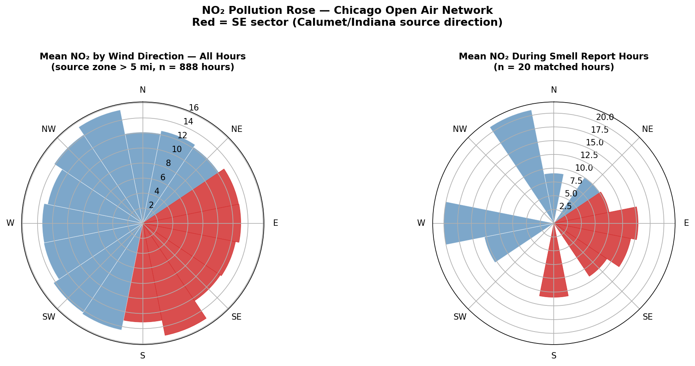

#### October 12 NO₂ case study

On October 12 — the largest smell episode — the Chicago Open Air NO₂ data show the same source-to-observer pattern seen in PurpleAir PM2.5: elevated NO₂ at distant sensors before reaching sensors closer to Hyde Park. This time-lag pattern in a second pollutant on independent hardware provides strong confirmation that airborne transport from the SE industrial corridor is real.

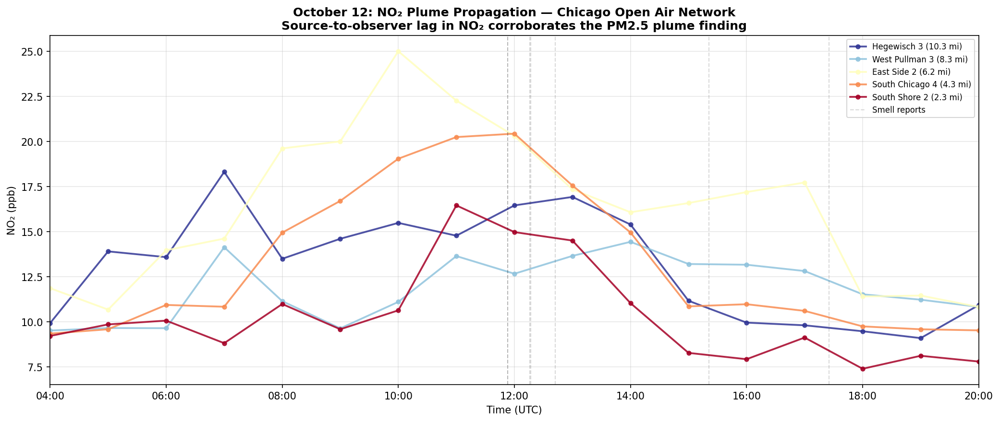

#### PM2.5 cross-validation

We compared hourly-mean PM2.5 between PurpleAir and Chicago Open Air sensors in matched distance bands. The two networks agree well, confirming the plume signal is not an artifact of PurpleAir sensor design or calibration.

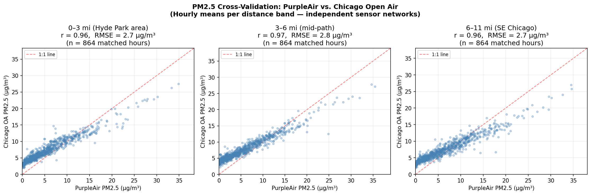

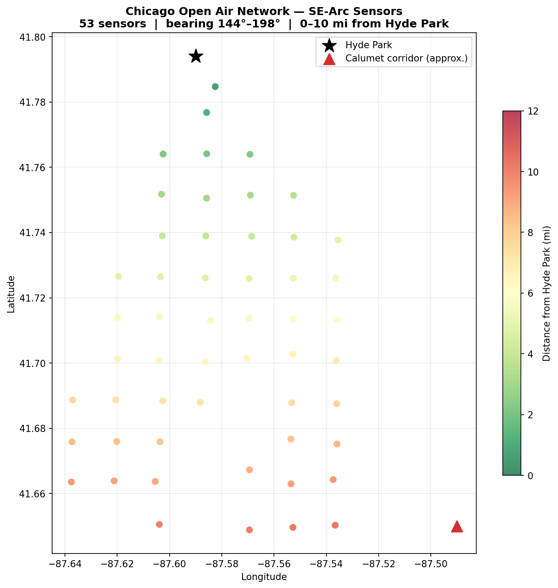

### EPA Regulatory Monitors

#### Why this matters

The PurpleAir and Chicago Open Air networks are low-cost or research-grade instruments. EPA Air Quality System (AQS) monitors are federal-reference-method instruments — the regulatory gold standard. If EPA monitors on the SE corridor show the same wind-dependent pollution pattern, the finding is not an artifact of sensor quality.

Three EPA sites fall on the SE corridor (bearings 131°–155° from Hyde Park):

| Site | Parameters | Distance | Bearing |
|------|-----------|----------|---------|
| Gary-IITRI | SO₂ | 19.6 mi | 131° SE |
| Hammond CAAP | SO₂ | 11.8 mi | 155° SSE |
| East Chicago-Marina | SO₂, Benzene | 12.6 mi | 141° SE |

SO₂ is a signature pollutant of coking, steel, and refinery operations — the dominant industries in the Calumet corridor — and has few local confounders in a residential area like Hyde Park.[^so2-source] Benzene is a known emission from coke ovens and petroleum refining, and is directly relevant to the "chemical" and "burning plastic" smell descriptions in the survey.[^benzene-source]

#### SO₂ during the October 25–27 episode

The October 25–26 smell episode — four reports over two days during sustained SE wind — coincides with sharp SO₂ spikes at all three corridor monitors. The figure below shows hourly SO₂ at each site with smell report times and wind direction overlaid. SO₂ is elevated precisely when wind is from the SE and drops when wind shifts.

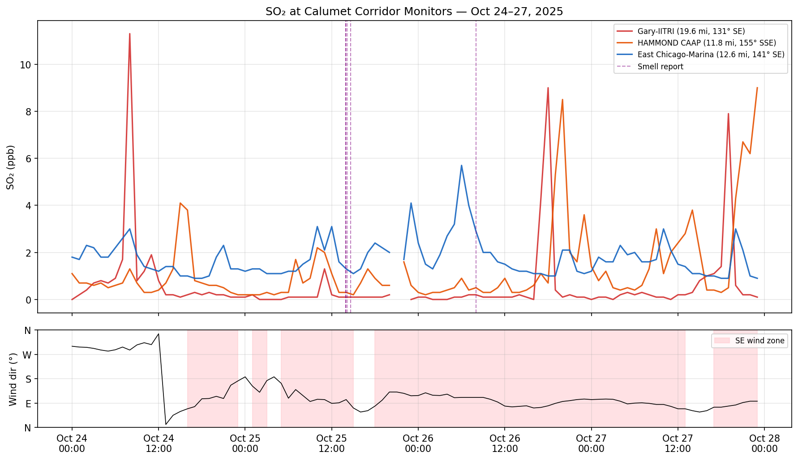

#### Benzene across the full study period

East Chicago-Marina is the only SE-corridor site with hourly benzene data. The full-period timeseries shows benzene peaks clustering during SE-wind windows and smell report periods. This is a VOC directly associated with coking and refinery emissions — a closer chemical match to the reported "burning plastic" odor than any of the criteria pollutants (PM2.5, NO₂, SO₂).

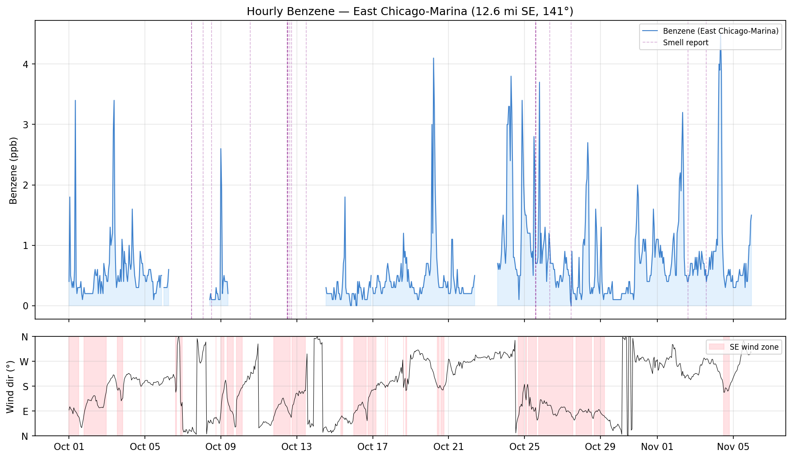

#### What the EPA data adds

The EPA monitors provide three things the low-cost networks cannot:

1. **Regulatory credibility.** Federal-reference-method data carries weight with agencies and courts in a way that PurpleAir and Clarity data do not.
2. **Source specificity.** SO₂ and benzene are far more diagnostic of industrial combustion than PM2.5, which has many sources. Elevated benzene during SE winds directly implicates coking and/or refinery operations.
3. **Convergent evidence.** The same directional pattern now appears in five independent measurements — smell reports, PM2.5 (two networks), NO₂, SO₂, and benzene — across three different monitoring technologies.

---

## Compliance Cross-Reference

The following information comes from facilities' own quarterly deviation reports filed with the Indiana Department of Environmental Management (IDEM). These are public records available through IDEM's Virtual File Cabinet.[^vfc]

### Indiana Harbor Coke Company (IHCC)

**Source:** Q4 2025 Quarterly Deviation and Compliance Monitoring Report, Permit No. T089-41059-00382, submitted January 28, 2026.[^ihcc-filing]

IHCC reported the following deviations during the study period:

**October 7** — Visible emissions from pushing operations exceeded the 20% opacity limit on oven A(44). The cause was high carbon buildup on the oven floor. Decarbonization was not completed until October 31 — meaning this oven operated in a degraded condition for 24 days spanning the first three weeks of smell reports.

**October 21** — Oven B(51) experienced a door leak for 60 minutes during push-side uptake elbow repair.

**19 positive-pressure events in the common tunnel** (continuation from Q3) — IHCC reviewed common tunnel pressure cell readings and observed positive pressure readings attributed to reduced draft from Cokenergy due to fouled heat recovery steam generators (HRSGs). Positive pressure in the common tunnel means coke oven gas can leak outward rather than being drawn through the collection system. IHCC states that no visible emissions were observed. However, coke oven gas does not need to be visible to carry VOCs and PAHs at concentrations detectable by the human nose.

**November 20 and 23** — Two additional charging opacity exceedances on D Battery.

**Significance:** The October 7 pushing violation occurred two days before the first smell reports in our dataset. The ongoing common tunnel pressure issues indicate that the coke oven gas collection system was operating in a compromised state throughout the entire study period.

### BP Products North America — Whiting Refinery

**Source:** Q4 2025 Title V Deviation and CAM Report, and Q4 2025 NSR Limit Report, Permit Nos. T089-30396-00453 / T089-41271-00453, submitted January 30, 2026.[^bp-filing]

BP Whiting's Q4 deviation report is extensive. The events most relevant to the smell investigation are:

**October 16 – November 3 (105 hours)** — The 4UF Flare exceeded the H₂S limit (3-hour rolling average >162 ppm) following a weld rupture at the Cat Feed Hydrotreating Unit. This was a continuous release lasting over four days. H₂S is detectable by the human nose at concentrations measured in parts per billion — orders of magnitude below the flare's exceedance threshold.[^h2s-odor] **This release was active during every smell report from October 16 onward**, including the major October 25–26 episode.

**October 11 (~3 hours)** — A catalyst leak from the FCU 500 slide valve packing released fine particulate through the stack. No formal opacity measurement (Method 9) was conducted; the event was reported on "credible evidence" only. This occurred the day before the largest smell episode (October 12). The unquantified catalyst release may account for some of the PM2.5 elevation observed in the plume propagation analysis the following morning.

**October 24** — A refinery-wide power blip caused the South Flare to exceed H₂S limits and produce visible smoke for 24 minutes. The FCU 500 coke burn monitor was simultaneously offline for 5 hours. This compound event occurred the day before the sustained October 25–26 smell episode.

**Chronic sources active throughout the study period:**

- Three pressure relief valves leaking continuously since February–May 2025 (VRU 100 and VRU 200), awaiting unit outages for repair.
- Coker Feed Tank TK-6254 exceeding the H₂S 12-month rolling limit since the January 2025 refinery fire, with vapors not fully routed to recovery.
- 312 components found undocumented during the 2025 leak detection and repair (LDAR) audit across four process units — representing an unknown background VOC/H₂S emission source with no historical monitoring record.
- Fenceline monitoring Station 26 offline for an extended period overlapping late Q3/early Q4 due to flooding — creating a data gap in the facility's own perimeter monitoring during the run-up to the study period.

### Facilities with no deviations

For completeness: TMS International (Gary Works scrap operations), Industrial Steel Construction, and US Steel East Chicago Tin Products all reported no deviations for Q4 2025.[^clean-reports]

---

## Limitations

This analysis has several important limitations:

**Sample size.** 39 reports from a convenience sample — not a random population survey. The 2.0× SE wind enrichment is statistically significant when reports are treated independently (binomial p = 0.0015),[^enrichment] but a permutation test that accounts for temporal clustering yields p ≈ 0.06–0.13.[^permutation] The directional signal is strong and corroborated by physical evidence, but the effective number of independent smell episodes is small — too small to achieve conventional significance on wind data alone, and too small to distinguish between individual facilities or detect weaker secondary patterns.

**Hourly wind resolution.** We match reports to the nearest hourly wind observation. The actual wind at the moment of the smell may differ, especially during transition periods.

**No single pollutant is uniquely diagnostic.** PM2.5 has many sources (traffic, construction, cooking). NO₂ narrows the source type to combustion but includes vehicle traffic. SO₂ is more specific to industrial combustion but is measured only at the source end of the corridor, not at Hyde Park. Benzene is the most source-specific indicator (coking and refining), but is available from only one monitor. The directional convergence across all five measurements makes non-industrial explanations unlikely, but we still cannot attribute the signal to a single facility.

**Self-selection bias.** People who suspect an industrial source may be more likely to report. Conversely, people who experience the smell but don't know about the survey don't report at all.

**Transport approximation.** Plume travel time is estimated as distance ÷ wind speed, a first-order approximation that does not account for turbulent diffusion, vertical wind shear, or terrain effects.[^transport-approx]

**Sensor accuracy.** PurpleAir sensors are low-cost instruments with known humidity sensitivity.[^purpleair-humidity] Chicago Open Air Clarity Node-S sensors are research-grade, not EPA-certified regulatory monitors. We mitigate both limitations by analyzing relative patterns (timing, gradients, directional enrichment) rather than absolute concentrations, by cross-validating between the two independent low-cost networks, and by confirming the directional signal on EPA federal-reference-method instruments (SO₂ and benzene).

**Facility naming.** The notebook's original references to "Acme/SunCoke" have been updated. The facility is Indiana Harbor Coke Company, L.P., currently operated as a contractor of Cleveland-Cliffs, Inc. The coke plant was previously owned by SunCoke Energy.[^ihcc-name]

---

## What Comes Next

This analysis establishes a strong directional signal and temporal correlation between industrial emissions and odor complaints in Hyde Park. Several extensions would strengthen the evidence further:

- **Continued smell reporting.** More data points improve statistical power and may reveal seasonal patterns.
- **Indoor air quality monitoring.** Deploying PM2.5 and VOC sensors in Hyde Park homes during SE wind episodes would measure actual indoor exposure.
- **HYSPLIT back-trajectory modeling.** NOAA's atmospheric transport model can trace where air parcels arriving at Hyde Park actually originated over the prior 6–12 hours, accounting for full atmospheric dynamics rather than surface wind alone.
- **Additional compliance records.** Q1 2026 deviation reports (due ~April 2026) will cover the later period of the smell survey. NRC reports and EPA enforcement actions may provide additional incident-level detail.

---

---

## Footnotes

[^enrichment]: The enrichment ratio is the fraction of smell reports during SE wind divided by the fraction of all hours with SE wind: 62% / 31% = 2.0×. A one-sided binomial test yields P(X ≥ 16 | n=26, p=0.31) = 0.0015, well below the conventional α = 0.01 threshold. However, because reports cluster temporally, the binomial test overstates confidence — see the permutation test[^permutation] for an independence-robust alternative.

[^permutation]: The episode-level circular-shift permutation test collapses clustered reports into distinct smell episodes (consecutive reports within 6 hours = one event), then shifts all episode timestamps by a single random offset modulo the study period length and reads the wind direction at the shifted times. This preserves the autocorrelation structure of the wind series, the temporal spacing between episodes, and the number of reports per episode. Over 10,000 random circular shifts, the permutation p-value is approximately 0.06–0.13 across gap thresholds of 3, 6, 12, and 24 hours. The result is directionally robust (the observed SE enrichment exceeds ~90–94% of random shifts) but does not reach conventional significance (α = 0.05), reflecting the small number of independent episodes. See the analysis notebook, Section 3.

[^coke-odor]: Coke oven emissions contain over 200 identified compounds including PAHs, benzene, toluene, xylene, phenol, and naphthalene. EPA classifies coke oven emissions as a known human carcinogen. The sensory profile — described in occupational health literature as acrid, tarry, and chemical — is consistent with the "burning plastic" descriptor used by Hyde Park residents. See: EPA, "Coke Oven Emissions — Hazard Summary," Technology Transfer Network Air Toxics; ATSDR, "Toxicological Profile for Coke Oven Emissions" (2017 update).

[^ihcc-name]: The facility at 3210 Watling Street, East Chicago, IN 46312 is operated by Indiana Harbor Coke Company, L.P., identified in IDEM filings as "a contractor of Cleveland-Cliffs, Inc." (Permit No. T089-41059-00382). The coke plant was previously owned by SunCoke Energy, Inc. Earlier versions of this analysis referred to the facility as "Acme/SunCoke."

[^bp-capacity]: BP's Whiting refinery has a crude oil processing capacity of approximately 435,000 barrels per day, making it the sixth-largest refinery in the United States. Source: U.S. Energy Information Administration, Refinery Capacity Report.

[^bp-penalty]: In 2023, the U.S. Department of Justice and EPA announced a settlement requiring BP to pay a $40 million civil penalty and install $197 million in pollution-prevention improvements at the Whiting refinery — the largest civil penalty ever secured for a Clean Air Act stationary source settlement. A prior settlement in 2022 required a $512,450 penalty and improvements to particulate monitoring and pollution control operations. Sources: DOJ press release, "United States and Indiana Reach Agreement with BP" (2023); Environmental Integrity Project, "BP Agrees to $500K Penalty" (2022).

[^shbell]: S.H. Bell Company's Chicago facility on Avenue O was subject to a 2017 EPA consent decree for manganese emissions. The facility handles bulk manganese-bearing materials. Source: EPA Region 5 enforcement action.

[^stable-atm]: High barometric pressure and light winds are associated with atmospheric subsidence inversions, which suppress vertical mixing and concentrate surface-level pollutants. This is a standard finding in air quality meteorology. See: Seinfeld & Pandis, *Atmospheric Chemistry and Physics* (3rd ed.), Ch. 16.

[^plume-spread]: At downwind distances of 10–15 miles, Gaussian plume dispersion models predict lateral spread on the order of 20°–40° of arc depending on atmospheric stability class. This is a first-order approximation. See: Turner, "Workbook of Atmospheric Dispersion Estimates" (EPA, 1970); Seinfeld & Pandis, Ch. 18.

[^transport-approx]: Plume travel time estimated as distance ÷ surface wind speed is a first-order approximation. Actual transport depends on vertical wind profile, turbulent diffusion, and boundary layer height. The close match between predicted and observed lag (3.4 hours predicted, 4 hours observed) suggests this approximation is adequate for the conditions during the October 12 episode.

[^pm25-general]: PM2.5 (particulate matter with aerodynamic diameter ≤2.5 µm) is a bulk measurement that includes contributions from all sources — industrial emissions, vehicle exhaust, cooking, construction dust, and secondary aerosol formation. It is not specific to any single pollutant or facility.

[^purpleair-humidity]: PurpleAir sensors use Plantower laser particle counters, which overestimate PM2.5 under high humidity due to hygroscopic growth of particles. EPA has developed a correction factor ("US-wide correction") to improve accuracy. See: Barkjohn et al., "Development and application of a United States-wide correction for PM2.5 data collected with the PurpleAir sensor," *Atmospheric Measurement Techniques*, 14 (2021), 4617–4637.

[^vfc]: IDEM's Virtual File Cabinet provides public access to facility compliance documents. Search at: https://vfc.idem.in.gov/FacilitySearch.aspx

[^ihcc-filing]: Indiana Harbor Coke Company, L.P., Q4 2025 Quarterly Deviation and Compliance Monitoring Report, Part 70 Permit No. T089-41059-00382, submitted to IDEM January 28, 2026. Filed by Edward Glass, General Manager.

[^bp-filing]: BP Products North America, Q4 2025 Title V Deviation and CAM Report, Permit No. T089-30396-00453, submitted to IDEM January 30, 2026. NSR Limit Report for the same period submitted under the same permit.

[^h2s-odor]: The human odor threshold for hydrogen sulfide (H₂S) is approximately 0.5–8 parts per billion (ppb). The BP Whiting 4UF Flare exceeded 162 ppm (162,000 ppb) on a 3-hour rolling average. While flare combustion destroys some H₂S, incomplete combustion during upset conditions and ground-level concentrations during poor dispersion can produce detectable odor miles downwind. Source: ATSDR, "Toxicological Profile for Hydrogen Sulfide/Carbonyl Sulfide" (2016).

[^so2-source]: Sulfur dioxide (SO₂) is produced by combustion of sulfur-containing fuels and materials — primarily coal, petroleum coke, and heavy fuel oil. In the Calumet corridor, the dominant SO₂ sources are coke ovens, blast furnaces, and refinery process heaters. SO₂ has relatively few sources in residential areas, making it a useful directional tracer for industrial emissions. Source: EPA, "Sulfur Dioxide Basics."

[^benzene-source]: Benzene is a volatile organic compound (VOC) emitted by coke ovens, petroleum refining, and chemical manufacturing. It is classified as a known human carcinogen (Group 1, IARC). Coke oven gas typically contains 1–3% benzene by volume. Source: ATSDR, "Toxicological Profile for Benzene" (2007); EPA, "Locating and Estimating Air Emissions from Sources of Benzene."

[^clean-reports]: TMS International LLC (Permit T089-42560-00174), Industrial Steel Construction (Permit T089-43131-00161), and U.S. Steel East Chicago Tin Products (Permit T089-00300) all reported no deviations for Q4 2025 in their Part 70 quarterly reports.
